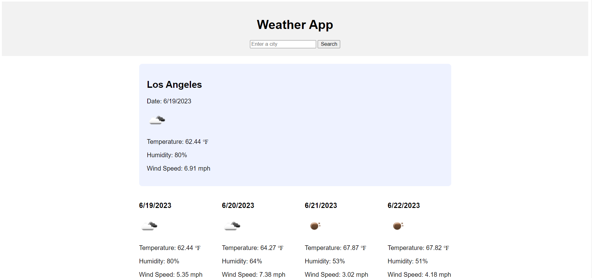
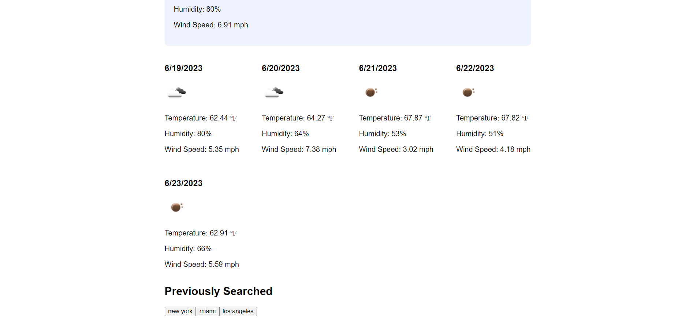

# Matts_Weather_App_Challenge_6

## Website Link

https://matthewlazarowitz.github.io/Matts_Weather_App_Challenge_6/

## Screenshot

## Description

For this challenge we were tasked with building a weather app using basic HTML and CSS, as well multiple functions and implementing an API using "OpenWeatherMap." to have users search for a city and return the current weather as well as a five day forecast for that location.  Lastly we also were required to include a previous search section that has buttons to bring the user to previous cities they looked for.  This task tested our ability to use different Javascript tools we had learned in class such as jQuery, implenting a third party API through Open Weather Map to retrieve and display data for the weather of the cities.  Ultimately this challenge was practice for using API's which we have doen previously through challenge 5 with the daily task site.  The other challenges were practcing using other skills we have used previously such as: if statements, then statments, for loops, functions, calls for those functions, etc. I used many functions in order to accomplish this feat.  After wrapping the DOM in jQuery I set variables for elements in functions I was going to define.  The functions I used were: "addCityToSearchHistory" initialy I had this function in the end of my code but after problem solving I realized the function needed to be defined before the call was made (this was great practice for realizing the order of my code matters).  The function itself actually adds buttons using the search history and adds a click event handler to the button that clears previous results and makes an API request for the city associated with the button.  Next I added a similar set of code for the submit button which also clears, makes the API request, but also clears the input as well and adds the city to the search history.  The next function is the "getCurrentWeather" which sets the variables for the API then extracts the data in the form of variables then I used those variables to create the HTML content by adding "<h>" "
" ""s with the data that I styled as well in JS.  Finally I appended the content from the current weather to the index's div. The next function is the "getForecast" which is almost exactly identical to the "getCurrentWeather" function except I added a for loop to go through the forecast data and create an HTML for each day, otherwise the process is basically the same for retrieving and outputing the data.

## Installation

N/A

## Usage

The application is a functional weather app that can accurately give you forecast for the current day and the 5 days ahead.  Sure, other weather apps more visually appealing and have more data to offer, but this was a great step for me understanding how these apps can be built and layed a groundwork for a functional weather app.  I am most proud in having a functional weather app being built by myself and working through issues like I had with adding the previous search buttons.

## Credits

(JD Tadlock)  (RUT-VIRT-FSF-FT-05-2023-U-LOLC)

## License

MIT License

Copyright (c) 2023 matthewlazarowitz

Permission is hereby granted, free of charge, to any person obtaining a copy
of this software and associated documentation files (the "Software"), to deal
in the Software without restriction, including without limitation the rights
to use, copy, modify, merge, publish, distribute, sublicense, and/or sell
copies of the Software, and to permit persons to whom the Software is
furnished to do so, subject to the following conditions:

The above copyright notice and this permission notice shall be included in all
copies or substantial portions of the Software.

THE SOFTWARE IS PROVIDED "AS IS", WITHOUT WARRANTY OF ANY KIND, EXPRESS OR
IMPLIED, INCLUDING BUT NOT LIMITED TO THE WARRANTIES OF MERCHANTABILITY,
FITNESS FOR A PARTICULAR PURPOSE AND NONINFRINGEMENT. IN NO EVENT SHALL THE
AUTHORS OR COPYRIGHT HOLDERS BE LIABLE FOR ANY CLAIM, DAMAGES OR OTHER
LIABILITY, WHETHER IN AN ACTION OF CONTRACT, TORT OR OTHERWISE, ARISING FROM,
OUT OF OR IN CONNECTION WITH THE SOFTWARE OR THE USE OR OTHER DEALINGS IN THE
SOFTWARE.

